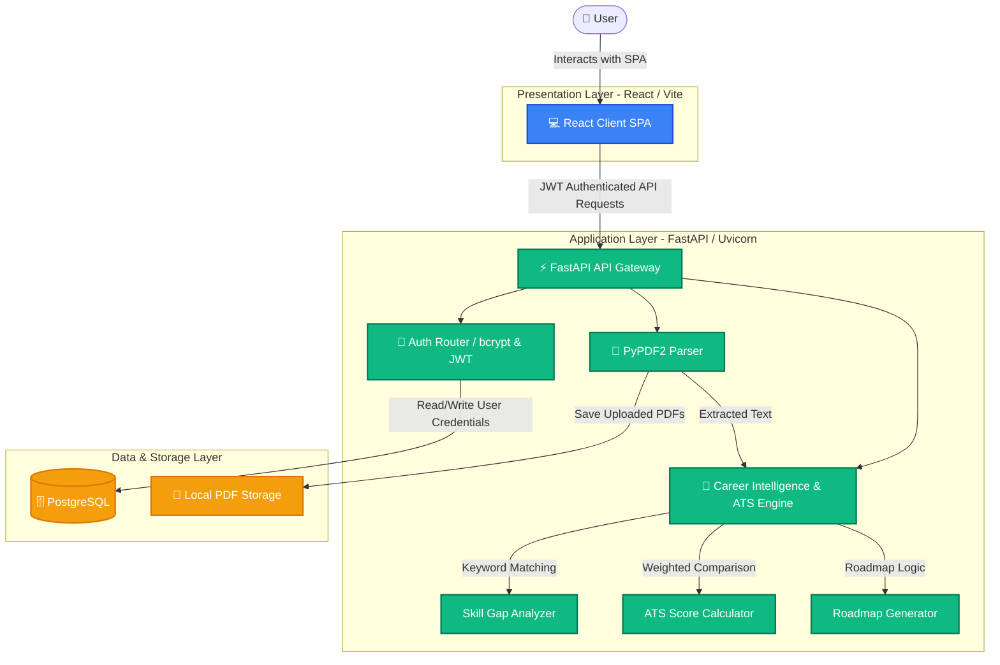

# 🚀 CareerForge AI

<p align="center">
  <strong>A Resume Analysis and Career Intelligence Platform</strong><br>
  <em>A Resume Analysis and Career Intelligence Platform that combines NLP-based resume parsing, ATS keyword matching, and rule-based recommendation engines to help students and job seekers improve their employability.</em>
</p>

<p align="center">
  
  
  
  
  
</p>

---

## 📚 Table of Contents
* [📖 About the Project](#-about-the-project)
* [✨ Key Features](#-key-features)
* [📌 Problem Statement](#-problem-statement)
* [💡 Why CareerForge AI?](#-why-careerforge-ai)
* [📈 Current Status](#-current-status)
* [📂 Project Structure](#-project-structure)
* [🏗️ System Architecture](#%EF%B8%8F-system-architecture)
* [🛠️ Tech Stack](#%EF%B8%8F-tech-stack)
* [📈 API Routes Directory](#-api-routes-directory)
* [🏃 Workflow Sequence](#-workflow-sequence)
* [🚀 Getting Started (Local Development)](#-getting-started-local-development)
* [🚀 Future Enhancements](#-future-enhancements)

---

## 📖 About the Project

CareerForge AI was developed to help students and early-career professionals gain actionable insights into their resumes through ATS compatibility analysis, career readiness evaluation, skill gap detection, and personalized learning recommendations. The platform combines resume parsing, career readiness analysis, ATS keyword matching, and personalized learning recommendations into a single intelligent dashboard that helps users understand their current standing and identify the next steps toward their target career.

---

## ✨ Key Features

✔ **Secure Authentication** – Register and login securely using password hashing and JWT access tokens.
✔ **Resume Upload** – Upload resumes in standard PDF format.
✔ **Resume Parsing** – Automatically extract resume text and map it to standardized skills.
✔ **Resume Analysis** – Receive an overall resume rating, grade, summary, and lists of strengths/weaknesses.
✔ **Career Readiness** – Evaluate how ready you are for different career paths.
✔ **ATS Compatibility Checker** – Compare your resume against custom Job Descriptions to isolate matched/missing keywords.
✔ **Target Role Recommendation** – Match resume profile qualities with software developer roles (Frontend, Backend, DevOps, Data Science) to see fit scores.
✔ **Personalized Learning Roadmap** – Generate priority-sorted learning paths for missing qualifications.

---

## 📌 Problem Statement

Many students and job seekers submit resumes without knowing:
* ⚠️ **ATS Compatibility:** Whether their resume is formatted to pass modern Applicant Tracking Systems (ATS).
* 🧩 **Recruiter Expectations:** Which skills recruiters actually search for in target roles.
* 🔍 **Skill Gaps:** Which critical qualifications they are missing.
* 📈 **Employability:** How prepared they are for a specific career path.

Existing resume analyzers typically return generic feedback or simple numerical scores. **CareerForge AI** bridges this gap by providing actionable, personalized career intelligence, directing users on what to improve, why it matters, and how to systematically acquire the needed skills.

---

## 💡 Why CareerForge AI?

Unlike traditional resume analyzers that only provide a numerical ATS score, CareerForge AI offers a comprehensive career intelligence platform. It combines resume parsing, ATS compatibility analysis, career readiness evaluation, target role recommendations, and personalized learning roadmaps to help users continuously improve their employability.

---

## 📈 Current Status

✅ **User Authentication** — Hashed passwords (bcrypt) and JWT access tokens.
✅ **Resume Upload** — PDF file handling and association with users.
✅ **Resume Parsing** — Text extraction and multi-alias skill cataloging.
✅ **Resume Analysis** — Overall resume rating, grade, and feedback generation.
✅ **Career Dashboard** — Central hub showing all career readiness stats.
✅ **ATS Analyzer** — Keyword overlap analysis against user-pasted job descriptions.
✅ **Career Readiness Module** — Compares skills with target tracks (Backend, Frontend, etc.).
🚧 **AI Interview Preparation** — Generating skill-based questions *(In Progress)*.
🚧 **Learning Resource Recommendation Engine** — Prioritizing specific tracks *(In Progress)*.
🚧 **LLM Integration** — Deep resume summaries and cover letter customization *(Planned)*.

---

## 📂 Project Structure

```
CareerForge-AI
│
├── backend/
│   ├── main.py          # FastAPI App entry point & API Router configuration
│   ├── parser.py        # PDF Parser, Skills Extraction, & Analytics logic
│   ├── database.py      # SQLAlchemy PostgreSQL connection settings
│   ├── auth.py          # Security password hashing helpers (bcrypt)
│   ├── models.py        # Database models (users, profiles, resumes tables)
│   ├── schemas.py       # Pydantic schemas for data validation
│   └── uploads/         # Storage folder for uploaded resume PDFs
│
├── frontend/
│   ├── src/
│   │   ├── components/  # Reusable React components and widgets
│   │   ├── pages/       # Login, Register, Dashboard page views
│   │   ├── services/    # API request configuration using Axios client
│   │   ├── App.jsx      # Main application router
│   │   └── main.jsx     # Vite index script mounting point
│   └── package.json     # Frontend dependencies and run scripts
│
└── README.md            # Comprehensive project documentation
```

---

## 🏗️ System Architecture

CareerForge AI is designed with a decoupled architecture splitting responsibilities cleanly between a dynamic React frontend, a high-performance FastAPI backend, a PostgreSQL relational database, and an NLP processing subsystem.

### 🗺️ Data Flow Diagram



### ⚙️ Component Breakdown
* **Client Layer (React & Tailwind CSS):** A single-page application built on React and compiled with Vite. Communication with the API is handled asynchronously via Axios.
* **Server Layer (FastAPI):** A fast Python REST API gateway that implements endpoints for authentication, file handling, and career evaluation.
* **Resume Parser:** Implemented in `backend/parser.py`, utilizing `PyPDF2` to read uploaded PDFs, match aliases, and isolate skills.
* **Career Intelligence & NLP Engine:** Formulates resume scores, skill gaps, weighted ATS compatibility scores, and maps matches to recommended roles.
* **Database & File Storage:** Database persistence is managed via SQLAlchemy ORM with a PostgreSQL database. Uploaded resumes are saved locally under `backend/uploads/`.

---

## 🛠️ Tech Stack

### Frontend
* **Core:** React.js
* **Bundler & Dev Server:** Vite
* **Styling:** Tailwind CSS
* **Routing:** React Router Dom
* **HTTP Client:** Axios
* **Icons:** React Icons

### Backend
* **Core Framework:** FastAPI
* **Runtime / Web Server:** Python & Uvicorn
* **Database Client:** SQLAlchemy & Psycopg2 (PostgreSQL adapter)
* **Authentication:** JWT (python-jose), Password Hashing (passlib with bcrypt)
* **Main API Gateway:** `backend/main.py`
* **Authentication Logic:** `backend/auth.py`
* **Token Management:** `backend/jwt_handler.py`

### Database
* **Relational DBMS:** PostgreSQL
* **ORM Declarations:** `backend/models.py`
* **Database Connections:** `backend/database.py`

### NLP Subsystem
* **Text Parser:** `PyPDF2` (extracts plain text from PDF bytes).
* **Processing Rules:** Custom regex, keyword weight distribution, and track matrix parsing in `backend/parser.py`.

---

## 📈 API Routes Directory

Below are the key backend endpoints exposed by the API:

### Authentication
* `POST /register` – Registers a new user.
* `POST /login` – Authenticates user and returns JWT bearer token.

### User Profiles
* `POST /profile` – Configures candidate profile settings.
* `GET /profile` – Retrieves candidate profile settings.

### Resume & Text Processing
* `POST /upload-resume` – Uploads and stores PDF resumes to the local server.
* `GET /parse-resume` – Extracts text and lists parsed skills.

### Analytics & ATS Tools
* `POST /ats-score` – Calculates ATS compatibility against a job description.
* `GET /analyze-resume` – Formulates missing skill listings.
* `GET /learning-roadmap` – Generates prioritized learning roadmaps.
* `GET /career-analysis` – Compares skills with target tracks.
* `GET /job-matches` – Returns matched roles and scores.
* `GET /resume-score` – Returns final resume score and grade letter.

---

## 🏃 Workflow Sequence

1. **Identity Setup:** User registers and authenticates; backend generates a secure JWT token.
2. **File Processing:** User uploads a resume in PDF format. Text is parsed using `PyPDF2` and mapped to defined skills.
3. **Core Engine Processing:** 
   * Identifies matching technical capabilities using a multi-alias vocabulary directory.
   * Compares achievements to the requirements of the selected track (Backend, Data Science, Fullstack, DevOps).
4. **Interactive Dashboard:** Generates resume ratings, lists strengths, highlights deficiencies, and offers a priority learning timeline.
5. **ATS Optimization:** Compares the profile text against pasted Job Descriptions to calculate dynamic ATS compatibility scores.

---

## 🚀 Getting Started (Local Development)

### 📋 Prerequisites
* PostgreSQL database installed and running.
* Python installed.
* Node.js installed.

### 🗄️ Database Setup
1. Open PostgreSQL (via pgAdmin or SQL Shell).
2. Create a new database named `careerforge_ai`:
   ```sql
   CREATE DATABASE careerforge_ai;
   ```
3. Ensure user credentials match the connection configuration declared in `backend/database.py`.

### ⚡ Backend Server Setup
1. Navigate to the backend directory:
   ```bash
   cd backend
   ```
2. Build and activate the Python virtual environment:
   ```bash
   python -m venv venv
   # On Windows:
   venv\Scripts\activate
   ```
3. Install the required Python dependencies:
   ```bash
   pip install fastapi uvicorn sqlalchemy psycopg2-binary PyPDF2 passlib[bcrypt] python-multipart python-jose[cryptography] pydantic[email]
   ```
4. Launch the Uvicorn development server:
   ```bash
   uvicorn main:app --reload
   ```
   *The server runs locally at `http://127.0.0.1:8000` (API documentation accessible at `/docs`).*

### 💻 Frontend Client Setup
1. Navigate to the frontend directory:
   ```bash
   cd frontend
   ```
2. Install npm dependencies:
   ```bash
   npm install
   ```
3. Run the Vite development server:
   ```bash
   npm run dev
   ```
   *The application will launch at `http://localhost:5173`.*

---

## 🚀 Future Enhancements

* 🤖 **AI-powered Resume Rewriting:** Automated rewording and keyphrasing suggestions for matching specific target companies.
* 🎙️ **AI Mock Interview Simulator:** Skill-specific mock coding and behavioral interviews.
* 📝 **Cover Letter Generator:** Custom cover letters tailored to targeted Job Descriptions.
* 💼 **LinkedIn Profile Analyzer:** Sync and cross-verify resume highlights against public profiles.
* 💻 **GitHub Profile Analysis:** Analyze project repositories to cross-examine technical competencies.
* 🎯 **Job Recommendation Engine:** Smart match notification system for roles aligning directly with your readiness level.
* 📊 **Learning Progress Tracker:** A modular step-by-step progress checklist for courses.
* 📜 **Personalized Certification Suggestions:** Suggest industry-recognized credentials matching missing skills.
* 🔄 **Resume Version Management:** Save and edit multiple versions of resume documents.
* 👥 **Recruiter Dashboard:** Allow hiring managers to filter candidates based on readiness grade search indexes.